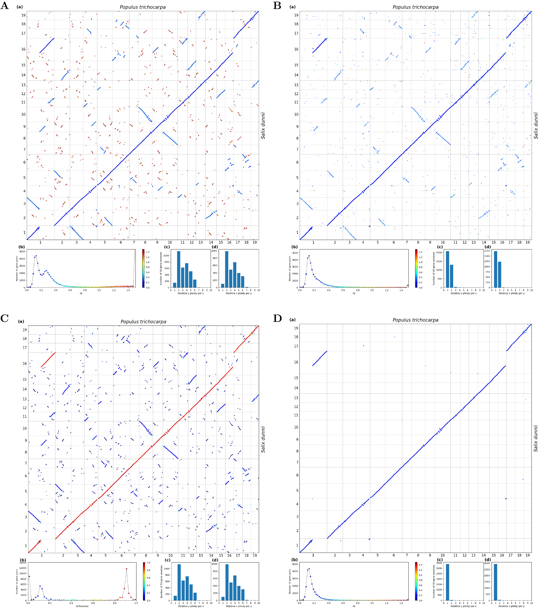

## Quick start ##
```
git clone https://github.com/zhangrengang/orthoindex.git
cd orthoindex
python3 setup.py install
cd example_data/
sh example.sh

# example.sh:
# dot plots
# A
soi dotplot -s Populus_trichocarpa-Salix_dunnii.collinearity.gz \
        -g Populus_trichocarpa-Salix_dunnii.gff.gz -c Populus_trichocarpa-Salix_dunnii.ctl  \
        --kaks Populus_trichocarpa-Salix_dunnii.collinearity.ks.gz \
        --xlabel '$Populus\ trichocarpa$' --ylabel '$Salix\ dunnii$' \
        --ks-hist --max-ks 1.5 -o Populus_trichocarpa-Salix_dunnii     \
        --plot-ploidy --gene-axis --number-plots
# B
soi dotplot -s Populus_trichocarpa-Salix_dunnii.orthologs.gz    \
        -g Populus_trichocarpa-Salix_dunnii.gff.gz -c Populus_trichocarpa-Salix_dunnii.ctl  \
        --kaks Populus_trichocarpa-Salix_dunnii.collinearity.ks.gz \
        --xlabel '$Populus\ trichocarpa$' --ylabel '$Salix\ dunnii$'  \
        --ks-hist --max-ks 1.5 -o Populus_trichocarpa-Salix_dunnii.o   \
        --plot-ploidy --gene-axis --number-plots  \
        --homology      # homology input
# C
soi dotplot -s Populus_trichocarpa-Salix_dunnii.collinearity.gz \
        -g Populus_trichocarpa-Salix_dunnii.gff.gz -c Populus_trichocarpa-Salix_dunnii.ctl  \
        --xlabel '$Populus\ trichocarpa$' --ylabel '$Salix\ dunnii$' \
        --ks-hist --max-ks 1 -o Populus_trichocarpa-Salix_dunnii.io    \
        --plot-ploidy --gene-axis --number-plots \
        --ofdir OrthoFinder/OrthoFinder/Results_*/ --of-color   # coloring by Orthology Index
# D
soi dotplot -s Populus_trichocarpa-Salix_dunnii.collinearity.gz \
        -g Populus_trichocarpa-Salix_dunnii.gff.gz -c Populus_trichocarpa-Salix_dunnii.ctl  \
        --kaks Populus_trichocarpa-Salix_dunnii.collinearity.ks.gz \
        --xlabel '$Populus\ trichocarpa$' --ylabel '$Salix\ dunnii$' \
        --ks-hist --max-ks 1.5 -o Populus_trichocarpa-Salix_dunnii.io  \
        --plot-ploidy --gene-axis --number-plots \
        --ofdir OrthoFinder/OrthoFinder/Results_*/ --of-ratio 0.6       # filtering by Orthology Index


# filter
soi filter -s Populus_trichocarpa-Salix_dunnii.collinearity.gz -o OrthoFinder/OrthoFinder/Results_*/ \
        -c 0.6 > Populus_trichocarpa-Salix_dunnii.collinearity.ortho
# or (alter input format)
soi filter -s Populus_trichocarpa-Salix_dunnii.collinearity.gz -o Populus_trichocarpa-Salix_dunnii.orthologs.gz \
        -c 0.6 > Populus_trichocarpa-Salix_dunnii.collinearity.ortho

```
### Example outputs ###


### Introduction ###
Orthology Index (OrthoIndex or OI) incorporates algorithmic advances of two methods (orthology inference and synteny detection), to determine the orthology of a syntenic block. 
It is straightforward, representing the proportion of orthologous gene pairs within a syntenic block. 

### Phylogenomics pipeline ###

Refer to [evolution_example](https://github.com/zhangrengang/evolution_example/) for a pipeline of phylogenomics analyses based on Orthology Index.
